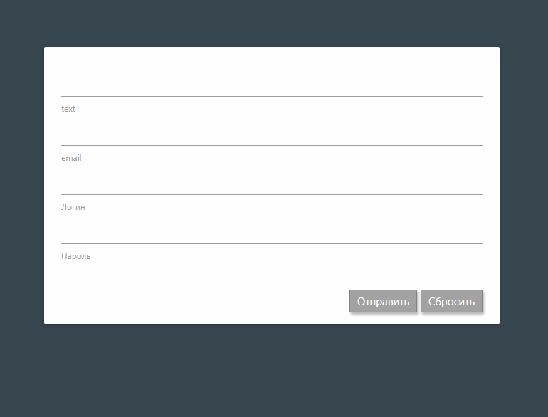

# React-Use-Form component React



## Demo:

[https://asosunoff.github.io/React-Use-Form/](https://asosunoff.github.io/React-Use-Form/)

### Install component

[npm i @asosunoff/react-use-form](https://www.npmjs.com/package/@asosunoff/react-use-form)

### Launch project:

```
git clone https://github.com/aSosunoff/React-Use-Form.git
cd React-Use-Form
npm i
npm run start
```

### Test project:

```
npm test
```
